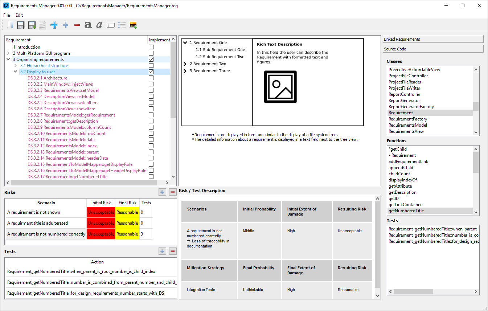

# Requirements Manager

Requirements Manager is a desktop software for risk-based requirements and test management in software projects.
It lets you organize your requirements in a hierarchical structure and describe them in rich text format. Entries
can be categorized as User Requirements, Functional Requirements or Design Specifications. For the latter ones,
imported source code comments can be used.

The program implements a simple risk assessment procedure, which helps you to focus test effort on the most critical
parts of your project. Test documentation can be imported from the source code and assigned to the risks they mitigate.
The implemented structure provides full traceability of the test and risks back their corresponding requirements.

## Features

* Organization of requirements in a tree structure together with their design specification
* Custom boolean and textual attributes for requirements
* Rich text description of requirements including images
* Categorization of requirements as "User Requirements", "Functional Requirements" and "Design Requirements"
* Import of source code documentation from C++ source (extendable to other languages)
* Risk Assessment for requirements and design specifications
* Import of source code test documentation and assignment to risks
* Html report generation

## Documentation

In progress...

## Built With

* C++
* Qt 5.5.1 MinGW 32 bit

## License

This project is licensed under the GNU GENERAL PUBLIC LICENSE - see the [LICENSE.md](LICENSE.md) for details.